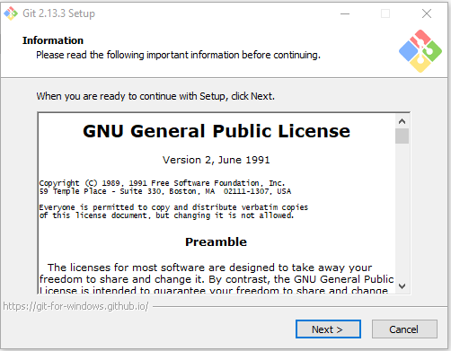
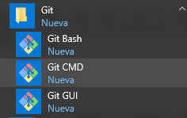
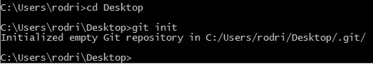
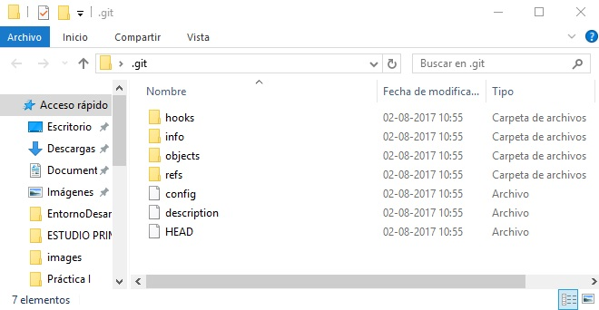
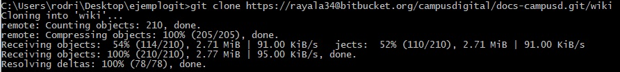
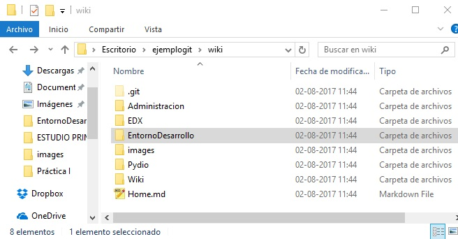
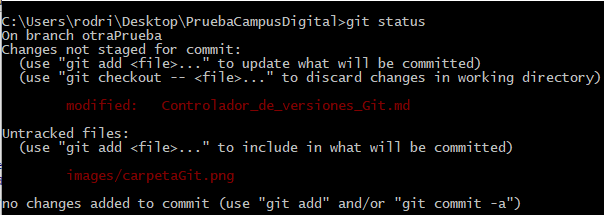
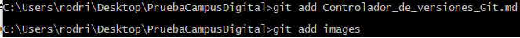
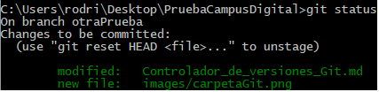
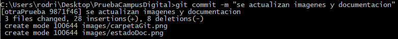

# Documentacion Git
________

### **Empezando** 

~~~ 
1. Acerca de Controlador de Versiones
~~~

descripcion

~~~
2. Instalacion de Git
~~~
La Instalacion puede ser de varias maneras pero las mas comunes son desde código fuente, o instalar un paquete existente para tu plataforma.

##### **Instalacion en Linux**

En general se puede hacer a travez de la herrmienta basica de gestion de paquetes. 

- Si estas en Fedora puedes usar el yum:
    ~~~ 
    $ yum install git-core
    ~~~

- Si estas en Ubuntu puedes prueba con apt-get:
    ~~~
    $ apt-get install git
    ~~~

##### **Instalacion en Mac**

Hay tres maneras de poder instalar Git en Mac

- Usar el instalador grafico de Git, se puede descargar desde
 [SourceForge](http://sourceforge.net/projects/git-osx-installer/)

- Puedes instalarlo a traves de [MacPorts](http://www.macports.org) con
    ~~~
    $ sudo port install git-core +svn +doc +bash_completion +gitweb
    ~~~

- Otra alternativa es con [Homebrew](http://brew.sh/) con
    ~~~
    $ brew install git
    ~~~

##### **Instalacion en Windows**

Para la instalacion se debe descargar el archivo exe del instalador desde [Git](http://msysgit.github.com/)

~~~
3. Configuraacion de Git
~~~

Git creara en tu sistema las siguientes carpetas que te permitran trabajar, lo que se documenta acontinuacion se asocia a la consola de git el Git CMD.

Git trae una herramienta llamada git config que te permite obtener y establecer variables de configuración, que controlan el aspecto y funcionamiento de Git.

**Identificacion**

- Lo primero que se hace cuando instalas Git es establecer tu nombre de usuario y dirección de correo electrónico. Esto es importante porque las confirmaciones de cambios (commits) en Git usan esta información.

    ~~~
    git config --global user.name "TuUsuario"
    git config --global user.email tuUsuario@example.com
    ~~~

##### **Fundamentos de Git** 

**Obteniendo un repositorio en Git**

Puedes obtener un proyecto de Git de dos maneras. La Primera toma un proyecto o directorio existente y lo importa en Git. La segunda clona un repositorio Git existente.     

- **Iniciar un repositorio existente**

    Se debe ir al directorio del proyecto y escribir

    ~~~
    git init
    ~~~

   

   Con el comando 'git init' sobre una carpeta nueva o sobre una ya existente, Git crea la carpeta auxiliar '.git'; la carpeta donde se ubica prácticamente todo lo almacenado y manipulado por Git. Si deseas hacer una copia de seguridad de tu repositorio, con tan solo copiar esta carpeta a cualquier otro lugar ya tienes tu copia completa.Tiene un aspecto como este

   

- **Clonar un repositorio existente**

   Para obtener una copia de un repositorio Git existente, un proyecto en el que     te gustaría contribuir, el comando que necesitas es

    ~~~
    git clone
    ~~~

   
    
   

**Comprobando el estado de tus archivos**

Para determinar qué archivos están y en qué estado, utilizaremos el comando git status. Si ejecutas este comando justo después de clonar un  repositorio, deberías ver algo así.

   
    
Si añadimos un nuevo archivo al proyecto, y ejecutamos git status, se veran los archivos sin seguimiento asi.

   

**Seguimiento de nuevos archivos**

Para empezar el seguimiento de un nuevo archivo se usa el comando git add. Iniciaremos el seguimiento de los archivos ejecutando esto.

~~~
git add
~~~

   

Si vuelvemos a ejecutar el comando git status, veremos que los archivos están ahora bajo seguimiento y preparado.

   

**Confirmando tus cambios**

Ahora que ya estan en seguimiento los archivos, se pueden confirmar los cambios. Cualquier cosa que todavía esté sin preparar (cualquier archivo que se haya creado o modificado), y sobre el que no hayas ejecutado git add desde su última edición, no se incluirá en esta confirmación solo se mantendrán como modificados en tu disco.

~~~
git commit -m "mensaje sobre los cambios  realizados"
~~~

   

- **Ramificaciones en Git** 
    1. 

