# Documentacion VirtualBox
________

### **Empezando** 

~~~ 
1. Acerca de VirtualBox
~~~

descripcion

~~~
2. Instalacion de VIrtualBox
~~~
Para instalarlo se debe ingresar a la pagina oficial de [virtualBox](https://www.virtualbox.org/wiki/Downloads) y descargar el paquete segun tu sistema operativo.

   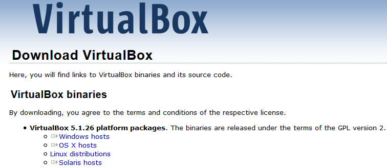
   

Realizaremos la descarga e instalacion para el sistema operativo windows.

   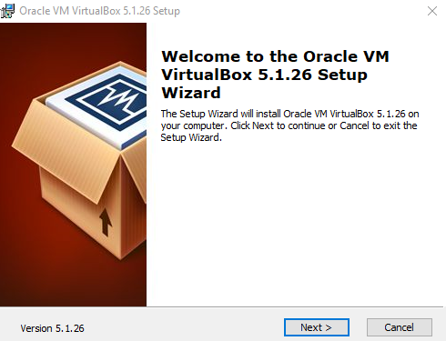
   
Se debe generar las siguientes carpetas, de las cuales utilizaremos Oracle VM VirtualBox

   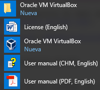
   
~~~
2. Configurar VirtualBox para incluir un sistema operativo virtual 
~~~

Utilizaremos el sistema operativo [ubuntu-12.04.5-desktop-i386.iso](http://releases.ubuntu.com/12.04/) el cual descargaremos como imagen para poder incluirlo en virtualBox.

**Instalacion de ubuntu en VirtualBox**

Una vez instalado virualBox vamos a dar clic en el icono Oracle VM VirtualBox el cual nos muestra el primer inicio en el cual aun no se a cargado ningun sistema operativo para lo cual debemos ahora dar clic sobre nueva para comenzar con la instalacion
   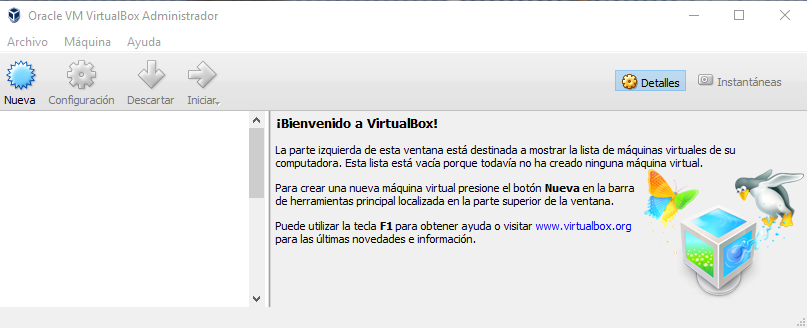

Una vez que ya dimos clic sobre nueva esta nos permite crear una maquina virual nueva que alojara nuestro sistema operativo, pero para comenzar primero la debemos configurar. 

   - Nombre del sistema operativo  
   Lo primero es darle un nombre y tipo de sistema operativo el cual queremos utilizar en nuestra maquna virtual a crear. 
   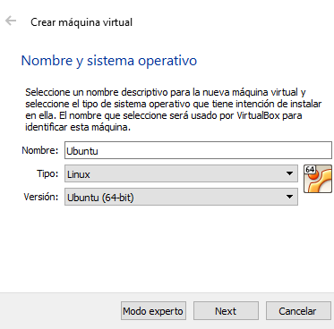
   
   - Tamaño de la memoria  
   Se debe asiganar la memoria que utilizara nuestro sistema operativo en la maquina virtual esta sera quitada del sistema anfitrion cuando el de la maquina virtual este en uso.   
   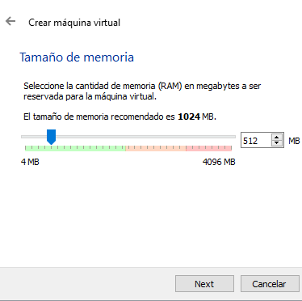
   
   - Tamaño del disco virtual  
   Se debe seleccionar la opcion de crear un disco virtual y el tamñao ya viene dado por defecto, mas adelante en la configuracion se puede cambiar el tamaño.     
   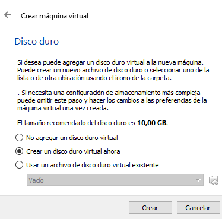
   
   - Asistente de creacion del disco  
   
   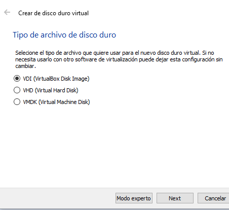
        
   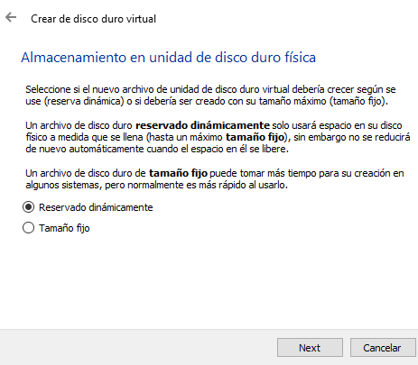
   
   
   
   - Maquina virtual  
   Como se ve en la siguiente imagen ya esta completa la creacion de nuestra nueva maquina virtual, ahora solo queda montar la imagen de el sistema operativo que utilizaremos.
   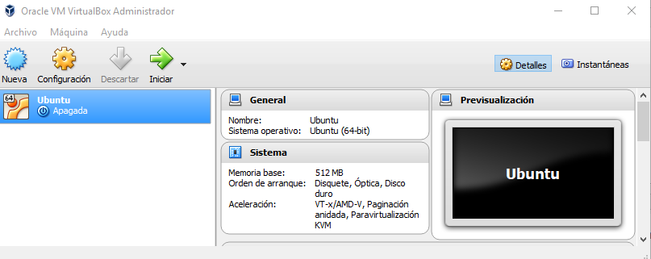
   
   Ahora debemos ir a la configurcion en la seccion de almacenamiento para poder asi dando clic en el simbolo de CD sdl cuadro de la derecha que  
permite seleccionar un archivo de disco virtual.

   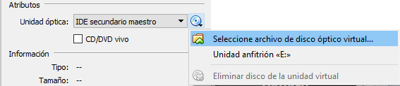
   
   Ubicamos la carpeta donde tenemos guardada nuestra iso con el sistema operativo y la seleccionamos.
   
   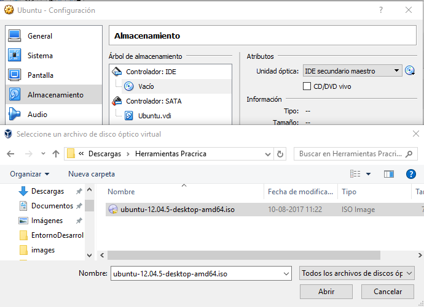
   
   Damos clic en aceptar, una vez agregada esta imagen nos mostarra nuevamente nustro inicio en la virtualBox y debemos dar clic a iniciar para poder instalar el sistema operativo de la imagen, en este caso ubunto y se vera mas o menos asi.
   
   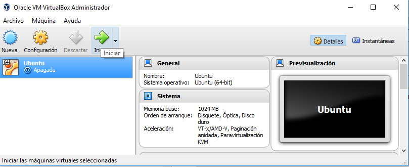
   
   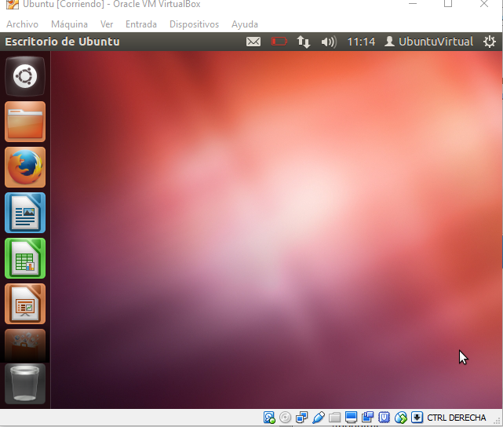
   

   

